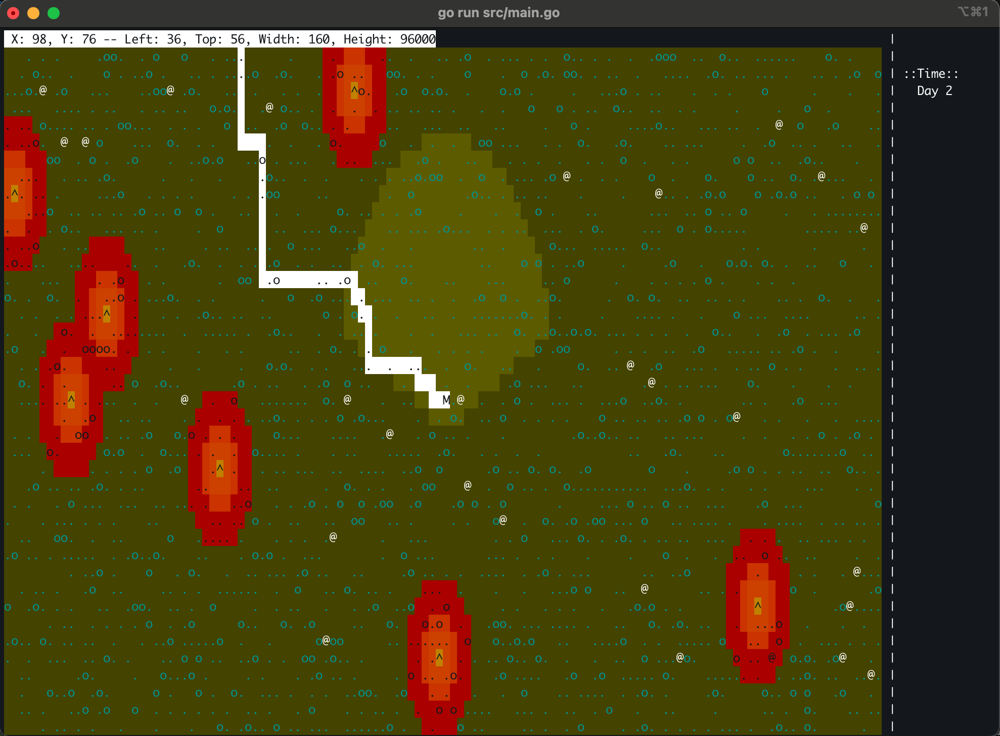
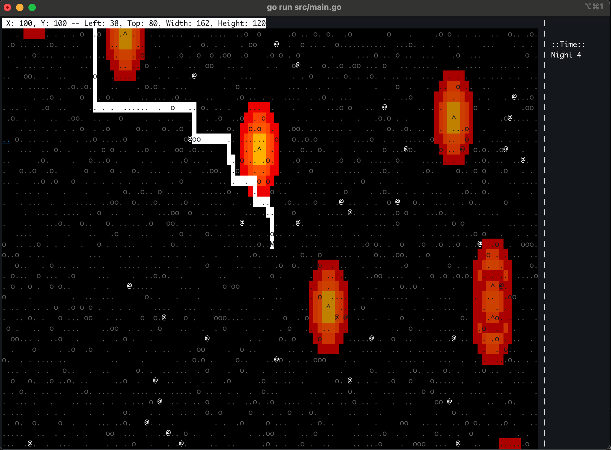

# Bot World game


This is just a fun side project. It is not meant to be used by anyone except the author. The purpose of this is to just program and have fun. It is meant to be a very low dependency game that I just add new features to whenever I need to code.

## Table of Contents
- [Overview](#overview)
- [Layout](#layout)
- [Understanding the Main Loop](#understanding-the-main-loop)
- [Modules and Their Relationships](#modules-and-their-relationships)
- [Game Flow](#game-flow)
- [Running](#running)
  - [Navigating](#navigating)
  - [Exiting the Game](#exiting-the-game)
  - [Key Mapping](#key-mapping)
- [Dependencies](#dependencies)
- [Contributing](#contributing)
- [Future Enhancements](#future-enhancements)


## Overview

Bot World is a terminal-based exploration game where you control a character moving through a procedurally generated world. It was built as a personal project to experiment with programming concepts and game mechanics. Some of what is implmeneted:

- **Dynamic Gameplay**: Navigate a procedurally generated map with NPCs and lighting mechanics.
- **Terminal Graphics**: Render the game world in a visually engaging way directly in your terminal.
- **Extensible Codebase**: Easily add new features and mechanics to explore programming ideas.

### Day Screen



### Night Screen



## Layout

```
Main Program (src/main.go)
│
├── Initializes Logging
│
├── Creates and Initializes the World (src/world/world.go)
│   ├── Map of Terrain Objects
│   ├── Player and NPCs
│   ├── Lighting System
│   └── Game Logic (e.g., Movement, Tick Updates)
│
├── Initializes Terminal (src/terminal/terminal.go)
│   ├── Handles Input Events
│   ├── Renders World State
│   └── Visual Styling (src/terminal/style.go)
│
├── Game Loop
│   ├── Polls for Player Input
│   │   ├── Movement
│   │   ├── Quit Signal
│   │   └── Map Interactions
│   ├── Updates NPC Movement
│   ├── Renders Updated World State
│   └── Manages Timing (Game Tick Rate)
│
└── Shutdown Logic
```

### Understanding the main loop

The main loop code is in `src/main.go`. 

```go
loop:
    for {
        select {
        case <-quit:
            break loop
        case <-time.After(time.Millisecond * 50):
        }
        start := time.Now()
        gameWorld.Tick()
        gameWorld.NpcMove()
        term.DrawWorld(gameWorld)
        term.Show()
        cnt++
        dur += time.Since(start)
    }
}
```

The main loop is on a 50 millisecond timer this controls the loop speed, you can make it faster, but this worked for the testing that I've been doing.

gameWorld.Tick is meant to be a timer within the game itself. I've been playing with day and night behavior. Tick lets us count how many 50ms cycles have passed since the start of the game.


## Modules and Their Relationships
1.	Main Program (src/main.go)
	* Entry point for the game.
	* Initializes logging, world, and terminal components.
	* Contains the main game loop, which coordinates input handling, game state updates, and rendering.
2.	World (src/world/)
	* world.go: Core logic for managing the game world, including:
	    * Map generation (RandomMap, InitWorld).
	    * Player and NPC movements.
	    * Time and lighting logic.
	* vision.go: Handles line-of-sight and lighting calculations.
	* paths.go: Implements pathfinding using the A* algorithm.
	* config.go: Manages terrain configuration for generating maps.
	* character.go: Defines characters (players, NPCs) and their attributes.
	* object/: Contains object definitions (e.g., terrain types, light sources).
3.	Terminal (src/terminal/)
	* terminal.go: Handles the interface between the game and the terminal.
	    * Draws the game world using terminal graphics.
	    * Captures player inputs (e.g., movement keys).
	* light.go: Computes light values for display.
	* style.go: Defines visual styles for terminal rendering, including color schemes for day/night cycles and object types.
4.	Geometry (src/geometry/geometry.go)
	* Provides utilities for spatial calculations (e.g., distance, overlapping regions).
	* Used for light effects, vision calculations, and pathfinding.

### Game Flow
1.	Initialization
	* Logger writes to game.log.
	* A default world is created with a player, NPCs, and randomized terrain.
	* Terminal is initialized for capturing input and rendering.
2.	Game Loop
	* Polls terminal events (PollEvent):
		* Arrow keys move the player.
		* Escape/Enter closes the game.
	* Updates NPC movements (NpcMove).
	* Redraws the game world (DrawWorld).
	* Enforces a 50ms delay for smooth updates.
3.	World State Updates
	* Player and NPCs interact with the map (Move, Tick).
	* Lighting and vision are calculated based on player position and time of day.
4.	Rendering
	* The terminal displays a slice of the world map around the player.
	* Objects, lights, and paths are visually represented.
5.	Termination
	* Gracefully shuts down the terminal and writes final logs.

## Running

To start the game just run it in code, I usually run it like:

```
go run src/main.go
```

This will run it without creating an executable.

### Navigating

The arrow keys allow you to move your character around.

### Exiting the game

You can use either the "enter" or "escape" key to exit out of the game. 


### Key mapping


The game uses the following keys by default:

| Key          | Action               |
|--------------|----------------------|
| Arrow Keys   | Move the player      |
| Enter/Escape | Exit the game        |

If you'd like to customize key mapping, you can modify the following code in `src/main.go`:

```go
quit := make(chan struct{})
go func() {
    for {
        ev := term.PollEvent()
        switch ev := ev.(type) {
        case *tcell.EventKey:
            switch ev.Key() {
            case tcell.KeyEscape, tcell.KeyEnter:
                close(quit)
                return
            case tcell.KeyLeft:
                gameWorld.Move(gameWorld.Player, world.West)
            case tcell.KeyRight:
                gameWorld.Move(gameWorld.Player, world.East)
            case tcell.KeyUp:
                gameWorld.Move(gameWorld.Player, world.North)
            case tcell.KeyDown:
                gameWorld.Move(gameWorld.Player, world.South)

            }
        case *tcell.EventResize:
            term.Show()
        }
    }
}()
```

## Dependencies

This project uses the following libraries:

- **[tcell (v2.8.1)](https://github.com/gdamore/tcell)**: A terminal control library used for rendering the game and handling input.
- **[astar (v0.3.0)](https://github.com/fzipp/astar)**: A Go implementation of the A* pathfinding algorithm, used for NPC movement and navigation.
- **[testify (v1.10.0)](https://github.com/stretchr/testify)**: A library for writing tests, used for validating the game's functionality.
## Contributing

This is a personal project, but feel free to fork it or submit ideas through issues. The goal is to explore and enjoy programming!

## Future Enhancements

### Gameplay Features
- Improved NPC AI to add dynamic behaviors.
- Save and load functionality for game sessions.

### Visual Improvements
- More detailed lighting effects for day/night cycles.
- Enhanced terminal rendering styles.

### Procedural Generation
- Additional terrain types and features.
- Refinements to the map generation algorithm.